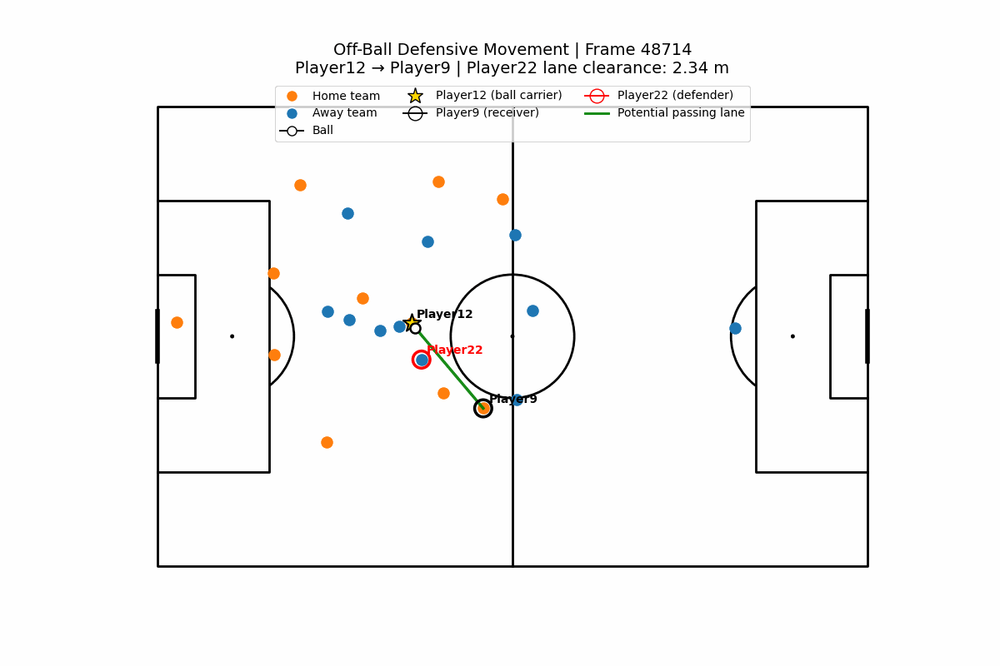
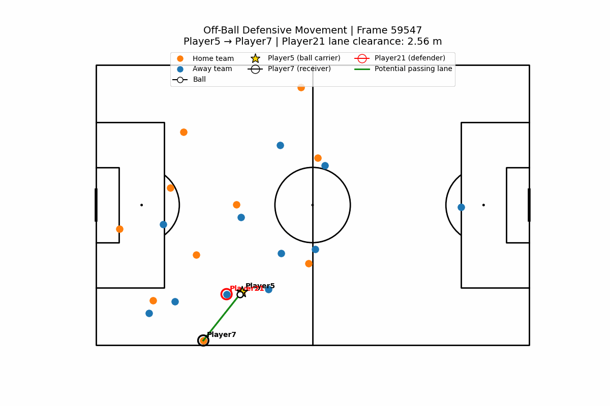

# Beyond Events: Quantifying Passing-Lane Defending with Tracking Data

## Overview

Traditional football event data records actions such as passes, shots, tackles, and interceptions. However, many valuable defensive actions never appear in an event log.

A midfielder can remove a passing option simply by moving into the right position. No tackle or interception occurs, but the defender may still influence the attacking team's decision.

This project uses player tracking data to explore whether these off-ball defensive actions can be identified quantitatively.

The central question is:

> **Can tracking data identify when an off-ball defender moves to close a passing lane and reduce the ball carrier's available passing options?**

The project develops a geometric and temporal framework for identifying controlled possession, constructing potential passing lanes, measuring defensive obstruction, and detecting when defenders actively reduce lane clearance over time.

---

## Motivation

As a football player, particularly in midfield, I am interested in actions that are tactically important but difficult to capture using traditional statistics.

A defender does not necessarily need to win the ball to have an impact. Positioning can:

- discourage a pass,
- remove an attacking option,
- force the ball carrier into another area,
- delay progression,
- or make a teammate's defensive task easier.

Tracking data provides the spatial information needed to begin measuring these actions.

---

## Data

This project uses **Metrica Sports Sample Game 1**, which contains synchronized:

- home-team tracking data,
- away-team tracking data,
- ball coordinates,
- and event data.

Source:

https://github.com/metrica-sports/sample-data

The tracking data is recorded at approximately **25 frames per second**.

Coordinates were converted from normalized coordinates to a **105 × 68 metre pitch**.

Processed CSV files are not included in this repository because of their size. See [`data/README.md`](data/README.md) for instructions on obtaining the source data and reproducing the analysis.

---

## Methodology

### 1. Identifying Controlled Possession

Before evaluating passing options, the model first determines whether a player appears to control the ball.

For every tracking frame:

1. calculate the distance between the ball and every player,
2. identify the nearest player,
3. require the player to be within a maximum control distance,
4. use temporal continuity to avoid unnecessary carrier changes when multiple players are close to the ball,
5. return no carrier when the ball appears to be in transit or uncontrolled.

The final parameters were:

- **Maximum control distance:** 2.0 metres
- **Switch margin:** 0.25 metres

The detector was validated against known pass-start events, where the recorded passer provides an approximate ground-truth ball carrier.

The final model correctly identified the recorded passer in approximately **97.5% of pass-start frames**.

Approximately **20.6% of all tracking frames** were classified as having no controlled possession. These include passes in transit, loose balls, stoppages, and other moments where no player is sufficiently close to the ball.

---

### 2. Constructing Potential Passing Lanes

For every frame with an identified ball carrier, each active teammate is treated as a potential receiver.

A straight-line segment is constructed between:

- the ball carrier, and
- each potential receiver.

This represents a simple geometric approximation of a possible ground passing lane.

For each lane, the analysis records:

- passer,
- receiver,
- pass length,
- closest relevant defender,
- distance between that defender and the passing lane,
- and the defender's position along the passer–receiver segment.

Defenders are only considered potential lane blockers when their perpendicular projection lies between the passer and receiver.

---

### 3. Measuring Lane Clearance

For each passer–receiver combination, the closest defender's perpendicular distance to the passing lane is calculated.

This value is referred to as **lane clearance**.

A smaller value means the defender is positioned closer to the geometric path of the potential pass.

Across the match, the analysis generated approximately:

- **115,000 controlled-possession frames**
- **1.15 million potential passing-lane observations**

Each normal possession frame contains approximately 10 potential passing options.

---

### 4. Detecting Lane-Closing Movement

A single frame only describes where a defender is positioned at one moment.

The more interesting question is whether that defender is **actively moving to reduce the passing space**.

The analysis therefore follows the same:

- passer,
- receiver,
- and closest defender

through consecutive frames.

Lane-clearance change is measured over a **0.4-second window**, corresponding to 10 tracking frames.

The resulting metric is:

```text
closing rate = change in lane clearance / time
```
Interpretation:

```text
negative closing rate  → defender is closing the lane
positive closing rate  → lane is opening
```

Using a 0.4-second window reduces frame-to-frame tracking noise while still capturing short defensive movements.

This is currently treated as a **continuous descriptive metric**, rather than imposing an arbitrary threshold for what qualifies as a "good" defensive action.

---

## Example: Closing a Passing Lane

The animation below shows a short sequence in which:

- **Player12** is the ball carrier,
- **Player9** is a potential receiver,
- **Player22** is the defender.

The potential pass is approximately **16 metres**.

During the sequence, Player22 moves toward the passing lane and reduces the geometric lane clearance from several metres to almost zero.



This illustrates the type of defensive action that may influence an attacking decision without producing a traditional defensive event such as a tackle or interception.

---

## Additional Example

A second sequence demonstrates the same concept with a different passer–receiver combination.



---

## Key Findings

This project demonstrates that tracking data can be used to identify defensive behaviour that is largely invisible in traditional event data.

In particular:

- controlled possession can be estimated reliably from player–ball distances and temporal continuity,
- potential passing options can be represented geometrically for every possession frame,
- defenders can be associated with specific passing lanes,
- and changes in lane clearance can provide a simple temporal signal of off-ball defensive movement.

The current metric should not be interpreted as a complete measure of defensive value. Instead, it provides a foundation for building richer models of how defenders influence an opponent's available options.

---

## Limitations and Future Work

This analysis provides a first geometric measure of how defenders can reduce a ball carrier's passing options, but it is still a simplified representation of off-ball defending.

One important limitation is that a single defender may close **multiple passing lanes during the same defensive movement**. The current framework evaluates each passer–receiver lane independently, meaning the same defensive action could effectively be represented several times. A future version should group simultaneous lane-closing actions and evaluate the defender's overall impact on the ball carrier's available passing options.

The current metric is also more appropriate for **short and medium ground passes** than for long balls. For a long pass, a defender may be close to the two-dimensional passing lane without actually preventing the pass because the ball could travel over the defender. Longer passes also take more time to reach the receiver, giving defenders additional time to recover or pressure the target.

A more complete model could therefore incorporate:

- expected ball travel time,
- pass distance,
- potential aerial versus ground trajectories,
- defender movement speed,
- receiver accessibility,
- pressure on the ball carrier,
- field position,
- attacking direction,
- nearby defenders,
- and the quality of alternative passing options.

The longer-term goal would be to build a defensive-value algorithm that **rewards these off-ball actions in a comparable way**.

For example, completely removing a short ground passing option should likely receive more credit than moving into the two-dimensional path of a long pass that could still travel over the defender.

The challenge is that defensive value is highly context dependent. Any future scoring framework would therefore need to account for the difficulty, importance, and consequence of each passing option rather than treating every closed lane equally.

For now, lane clearance and lane-closing rate should be interpreted as **descriptive defensive signals rather than complete measures of defensive value**.

---

## Repository Structure

```text
.
├── README.md
├── requirements.txt
├── notebooks/
│   ├── 01_data_exploration.ipynb
│   ├── 02_passing_lanes.ipynb
│   ├── 03_ball_carrier_identification.ipynb
│   └── 04_continuous_passing_lanes.ipynb
├── figures/
│   ├── player5_player7_player21_sequence.gif
│   └── player12_player9_player22_sequence.gif
└── data/
    └── README.md
```

---

## Notebooks

### `01_data_exploration.ipynb`

Loads and cleans the Metrica tracking and event data, converts coordinates to metres, and verifies synchronization between tracking and event information.

### `02_passing_lanes.ipynb`

Develops the initial geometric passing-lane framework on individual frames and calculates the distance between defenders and potential passing lanes.

### `03_ball_carrier_identification.ipynb`

Develops and validates the continuous possession detector used to identify the ball carrier across the match.

### `04_continuous_passing_lanes.ipynb`

Extends the passing-lane framework to every controlled-possession frame and develops the temporal lane-closing metric.

---

## Reproducing the Analysis

1. Clone this repository.

2. Download **Sample Game 1** from the Metrica Sports sample-data repository.

3. Place the raw files in:

```text
data/
```

4. Install the required Python packages:

```bash
pip install -r requirements.txt
```

5. Run the notebooks in order:

```text
01_data_exploration.ipynb
02_passing_lanes.ipynb
03_ball_carrier_identification.ipynb
04_continuous_passing_lanes.ipynb
```

Notebook 3 generates the processed possession dataset used by Notebook 4.

Large processed CSV files are excluded from GitHub.

---

## Technologies

- Python
- pandas
- NumPy
- Matplotlib
- mplsoccer
- Jupyter
- Metrica Sports tracking and event data

---

## Author

**Rebeka Róth**

Statistics & Data Science graduate from Yale University and professional football player.

I am particularly interested in applying data science to football problems where traditional event statistics do not fully capture what happens on the pitch.
